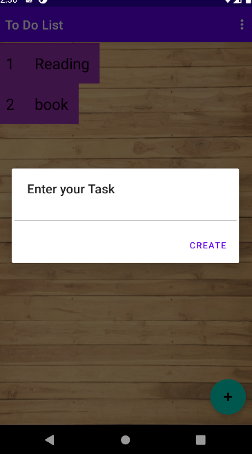

# To-Do-List-App-For-Android

To-Do-List-App-For-Android is basic android app which can help to note down our daily task.
The main feature of this of this app is this is fully dynamic. No Hardcode value is used in this app through this a basic that why no database is used in this app.This app use String value file to recoed the data and this app has different class to enter the data nad get the data.
this app will support android Kitkat and higer android devices.

This the basic UI of the app.

Please let me know if there is any problem in the app or any thing for the improvement.I will Try to do it as soon as posssible
